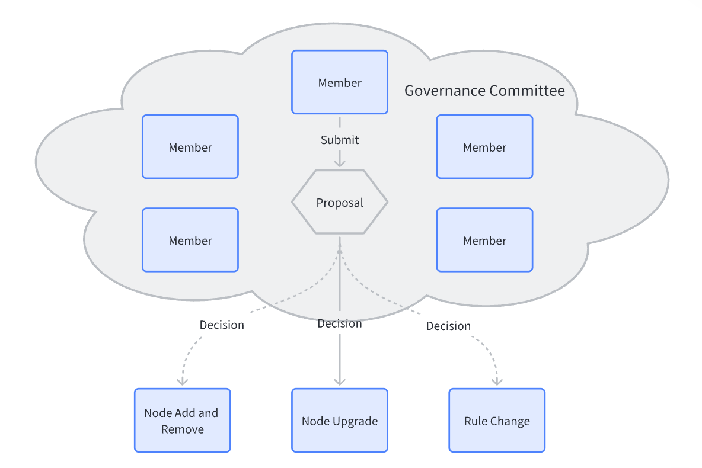

Governance is mainly divided into two steps. The first is to submit a proposal, and then the committee members vote on the proposal. When the number of passed votes meets the conditions (for example, more than half of the votes), the proposal is accepted and will be automatically executed on the chain. the proposal.

The content of the submitted proposal mainly includes:

1. Proposal name, a summary of the content of the proposal;

2. Proposal description, describe the content of the proposal in detail, if the content of the proposal is too long, you can attach a link to the content;

3. Proposer;

4. Proposal type, which type of proposal, such as node upgrade, node joining, node exit, committee election, etc.;

5. Proposal effective block height, optional, you can specify the block height after which the proposal will take effect, if not filled, it will take effect immediately;

6. Proposal cut-off block height, specifying that the proposal must be voted before the cut-off block height is reached, otherwise the proposal will be terminated, avoiding that the proposal has not been voted for a long time, resulting in failure to end;

7. Proposal additional information, different types of proposals may have additional information attached, if any, put it in this field.

