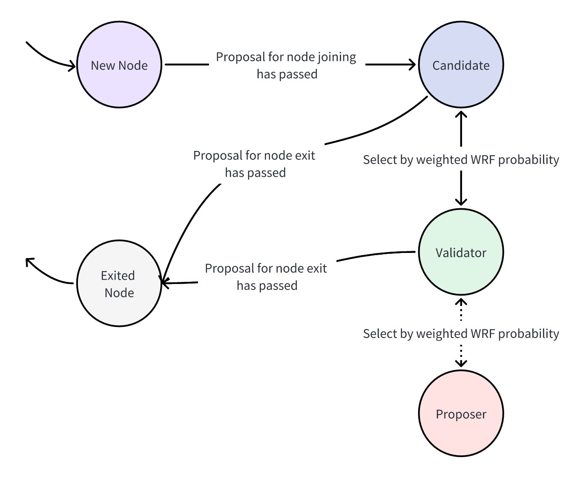

# Key Concepts
Consensus algorithm is a mechanism to ensure that multiple nodes in a blockchain network reach an agreement. Byzantine Fault Tolerance (BFT) is one of the important algorithms suitable for public blockchain environments. BFT-based algorithms achieve consensus through multi-round voting or message exchanges, ensuring the liveness and security of blockchain systems even in the presence of a small number of faulty or malicious nodes.

# Overview of dBFT
Practical Byzantine Fault Tolerance (PBFT) is a consensus algorithm based on BFT principles. PBFT enables fast and secure confirmation of transactions and is widely used in public blockchains. However, native PBFT suffers from issues such as predictable primary nodes and poor scalability. To address these concerns, AxiomLedger has optimized and improved PBFT, implementing the **Delegated Byzantine Fault Tolerant (dBFT)** algorithm.

## Basic Process
The transaction process within the consensus module of AxiomLedger is outlined as follows:

    1. The TxPool receives validated transactions from P2P and API sources.
    
    2. The TxPool sorts transactions based on tx account nonce, categorizing them into a set of ready transactions and a set of unready transactions. Transactions in the priorityTx set can be packed by Proposers but are not yet included, while transactions in the parkingLotTx set cannot be included temporarily (usually storing transactions with higher nonces during high concurrency).
    
    3. The Proposer of the current term, based on the packaging strategy, retrieves a certain number of transactions from the priorityTx set in the TxPool, collect these transactions into a block, and propose a consensus proposal for the current block.
    
    4. All Validators in the node consensus network participate in multi-round voting consensus for the block proposal, and once conmmited, the block is sent to the executor for transaction execution.

<Tip>
    For performance reasons, Validators/Proposer do not execute transactions within the current block during block consensus. After consensus is achieved, the executor handles transaction execution. Consensus on post-execution state consistency is ensured through the state checkpoint mechanism.
</Tip>

## State Checkpoint Mechanism

After the executor completes the execution of transactions within a block, the block is persisted. Simultaneously, the consensus module is notified of the execution results of the current block (including the block hash containing state root, receipt root, block height, etc.). When the block reaches a checkpoint, Validators start consensus on the latest block's information to ensure ledger consistency (e.g., a checkpoint interval of 10 blocks results in an account state confirmation every 10 blocks). Once a sufficient consensus on checkpoint information is received, Validators can continue with block consensus.

Moreover, to prevent delayed block heights from reaching checkpoint, Validators will set a timeout mechanism. When the timer triggers, Validators actively consensus on the latest block information.

The state checkpoint mechanism guarantees eventual ledger consistency. Validators do not need to start consensus on block execution results during the block packaging process, effectively improving consensus performance.

## Node Types

The native PBFT algorithm considers all network nodes as Validators. However, as the number of network nodes increases, consensus performance is limited by O($n^2$) communication complexity, leading to performance degradation.

To address this issue, AxiomLedger introduces distinct node types:

    - **Proposer** : Possesses all the functionalities of a Validator and is responsible for packaging blocks within the current term.
    - **Validator** : Participates in consensus and can verify and vote on packaging proposals presented by Proposers.
    - **Candidate** : Joins the network, does not participate in consensus, only synchronizes blocks.

This differentiation keeps the consensus node scale relatively stable, preventing it from growing with an increasing number of nodes and contributing to improved efficiency and scalability. Node role transitions are detailed in the next section.

## Node Role Transitions

In the AxiomLedger blockchain network, node role transitions officially take effect during epoch changes. Node role transitions are as follows:

    - **New Node → Candidate** : A new node proposing to join needs to submit a proposal. Once approved by governance, the new node formally joins the network and becomes a Candidate.
    - **Candidate ↔ Validator** : During each epoch change, the epoch management contract employs the WRF algorithm to select a specified number of Validators from the Candidates. When epoch change conditions are met (usually at a certain checkpoint interval), all nodes already in the AxiomLedger network update their Validator set. For details on the WRF algorithm, refer to the next section.
    - **Validator ↔ Proposer** : After the epoch management contract is updated, Validators determine Proposers using the WRF algorithm. The chosen Proposer is responsible for packaging blocks within the current term (term interval equals checkpoint interval).
    - **Candidate/Validator ↔ Exited Node** : Once an exit proposal is approved, a node can exit the network.

## Epoch Change

### WRF Algorithm

WRF (Weighted Random Function) is a method for random selection based on assigned weights. When a node joins the network, each node is assigned a different weight. All node weights are mapped onto an interval. Then, using the provided random number seed, a random number generator generates a random number. The node is selected based on the interval where the random number falls. Nodes with higher weights occupy a larger portion of the interval and are more likely to be selected.

In AxiomLedger, both the selection of the Validator set and the Proposer use the WRF algorithm. However, the allocation of random number seeds differs.

    - **Validator Set Selection** : Latest block hash (previous checkpoint's block), current epoch information recorded by the epoch contract, number of Validators currently selected.
    - **Proposer Selection** : Information from the last checkpoint, current epoch information recorded by the epoch contract, current term number.

The advantages of the WRF algorithm include:

    - **Flexibility and Customization** : The WRF algorithm can allocate different weights to each node based on specific requirements (e.g., stake ratio, governance allocation), flexibly controlling the probability distribution for random selection.
    - **Efficiency** : As random number seeds are content already achieved through consensus, no additional round of consensus is needed for the random seed. Only basic mathematical calculations are involved.
    - **Security** : Since confirmation of the random number seed requires waiting for the last block to be produced in the checkpoint, it's impossible to predict the random number in advance, hence the Validator set cannot be predetermined. Similarly, as Proposers are selected from the Validator set, the block producer of the current term cannot be known in advance.

### Main Process
Epoch changes are executed through the built-in epoch management contract, which includes epoch number, epoch interval, term interval, and other information. The epoch management contract is responsible for confirming Validator sets and Candidate sets for each epoch. The epoch management contract stores Validator sets and Candidate sets for each epoch, and updates are carried out using the WRF algorithm.

<Tip>
    Each WRF process selects one Validator, thus the number of WRF rounds is related to the number of Validator sets.
</Tip>

Each term interval corresponds to a checkpoint interval. Within this interval, a Proposer is assigned. If a Proposer encounters abnormal states such as downtime during this interval, an exceptional term transition will be triggered. It is important to note that after an exceptional term transition, the term interval is not a checkpoint interval; rather, it is the checkpoint interval minus the previous exceptional term interval (e.g., term 3 + term 4 = term interval).

