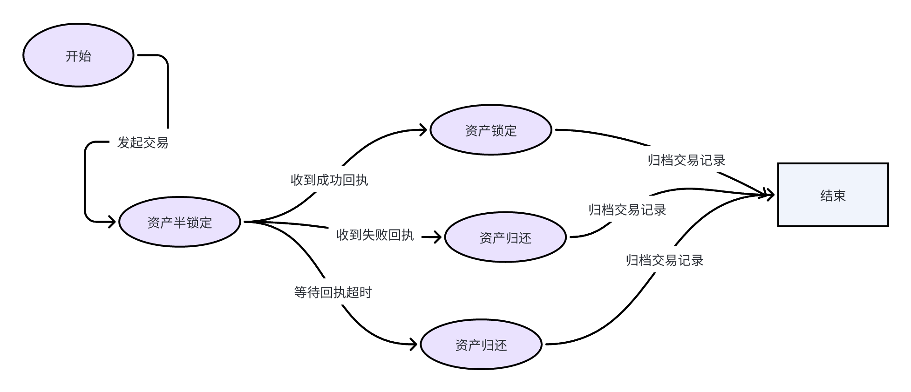

Axiomesh 的跨链机制适用于所有 EVM 兼容的区块链，Axiom 的跨链机制不仅可以保证消息的跨链传输，还能保证 Axiomesh 与其他链后者其他链与 Axiomesh 进行资产交换时，对交易的事务进行保证。

# 跨链中继器

跨链中继器是 Axiomesh 跨链体系中重要的一环，他的主要作用是将一条链上的跨链消息传递到另外一条链上，跨链中继器分为两个部分，两个部分分别承担不同的角色，只有两部分都提交后跨链的消息才能够真正的在目的链上进行执行，从而防止了单点作恶的可能。

Axiomesh 有官方自己维护的跨链中继器， Axiomesh 推荐用户或者应用使用官方的跨链中继器以维护资产跨链的安全，保证消息的准确。

# 跨链管理合约

跨链管理合约是 Axiomesh 跨链体系中的发动机，当一个用户或者一个链上应用要发起区块链跨链请求时，必须通过跨链管理合约进行。

来源链上的跨链管理合约包含了对跨链主体的管理，对于跨链类型的分流，对于跨链消息的封装以及将跨链事件的抛出

目的链上的跨链管理合约包好了对跨链消息目标的检查，对于封装后跨链消息的解码，对目的合约的调用。

# 跨链流程详解

## 消息跨链流程

跨链消息的传递相对来说比较简单，用户和应用只需要将需要传递的消息发送给跨链管理合约即可，Axiom 的跨链体系会把消息传递给目的链的对应合约中。

消息跨链的整个流程如下：

1. 用户或者应用发起一笔交易;
2. 交易调用跨链管理合约;
3. 跨链管理合约封装好跨链交易的内容并且将内容作为事件抛出;
4. 中继器捕获了跨链消息事件，并且中继器的两个服务都会向目的链发送跨链消息请求;
5. 目的链的跨链管理合约接收到跨链交易并且将跨链内容进行解析;
6. 目的链的跨链管理合约调用目的链的应用合约来完成跨链请求。

## 资产跨链流程

跨链资产传递相对来说更加复杂，为了保证跨链资产的原子性，资产跨链的消息需要等待目的链发送的回执消息，只有等到了成功的回执，来源链的资产才会被真正锁定，如果时失败回执或者消息回执等待超时，来源链的资产将会被返回给用户或者链上应用

资产跨链的整个流程如下：

1. 用户或者应用发起一笔交易;
2. 交易调用跨链管理合约;
3. 跨链管理合约封装好跨链交易的内容并且将内容作为事件抛出;
4. 中继器捕获了跨链消息事件，并且中继器的两个服务都会向目的链发送跨链消息请求;
5. 目的链的跨链管理合约接收到跨链交易并且将跨链内容进行解析;
6. 目的链的跨链管理合约调用目的链的应用合约.
7. 如果目的合约执行成功，返回成功的回执，反之，返回失败的回执；
8. 中继器捕捉到了回执并将回执返回给来源链;
9. 来源链合约判断回执并执行锁定资产或者归还资产的指令。

# 深入资产跨链

资产跨链中最值得关心的是资产在各个阶段的状态

下面是资产在资产跨链中的状态图

当用户发起资产跨链时，资产将会进入一个半锁定的状态，这个状态下的资产将会被记录在 Axiomesh 的跨链合约中，但并没有被完全锁定，需要等待跨链消息的回执再进行下一步操作

当来源链接收到成功的回执后，资产就会被锁定在来源链中，如果收到的时失败的回执，资产就会被返回给原来的用户或者合约

Axiomesh 的跨链体系也考虑了交易的超时机制，当来源链被半锁定的资产迟迟无法收到目的链的回执时，用户或者链上合约可以手动触发超时回滚，将被半锁定的资产归还给原来的用户或者合约。
