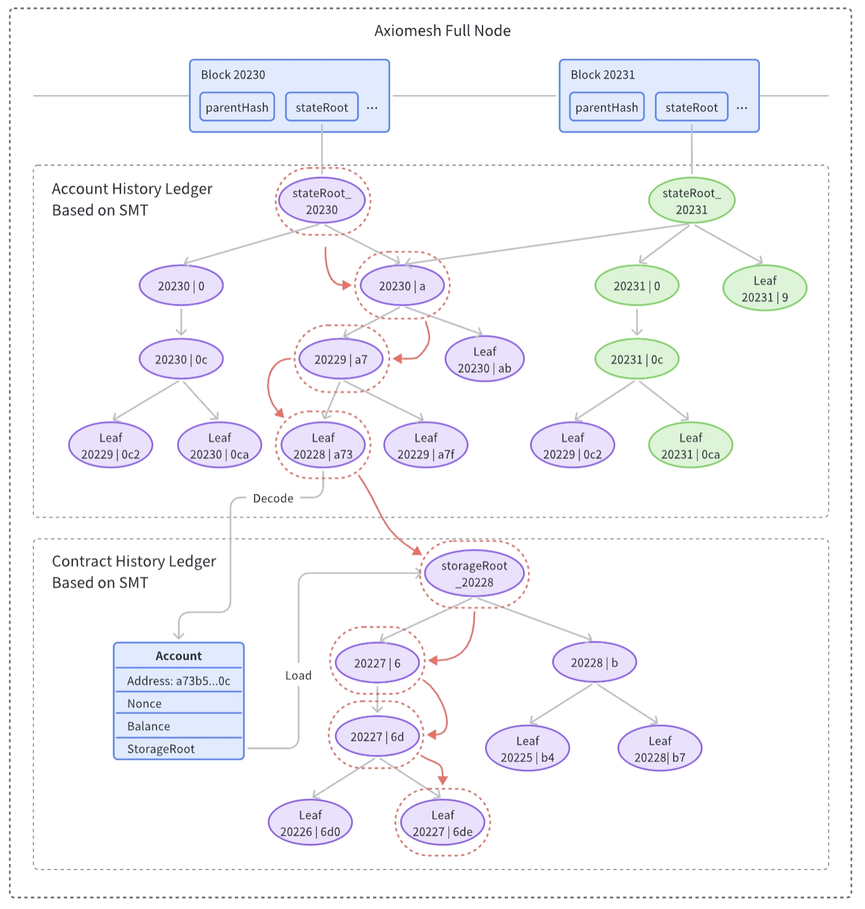
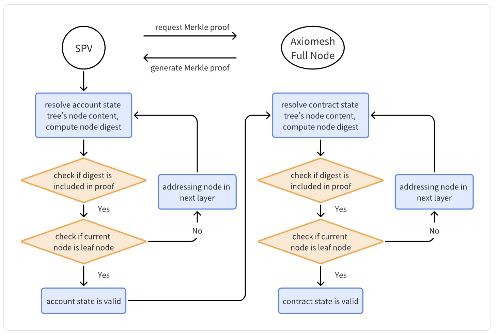

In this chapter, we will introduce in detail the authenticated data structure and KV storage engine in ledger components, as well as the verification process of SPV nodes.

# SMT
The ledger component uses Sparse Merkle Tree (SMT) as an authenticated data structure. SMT is an optimized Merkle tree, which reduces the number of nodes in the tree by recursively merging single-leaf subtrees, thereby speeding up addressing and reducing waste of storage space. At the same time, we construct the key of the SMT node based on the block number. When using the KV storage engine based on the LSM tree, this scheme can significantly reduce the compaction overhead of the storage engine.

SMT is used as the default implementation of account state tree and contract state tree in AxiomLedger. The account state tree records the state of all accounts under the current block, and its root hash is included in the block header of each block. The contract state tree records the value of the contract state variables, and its root hash is included in the account entity.

The following figure shows the history ledger architecture of AxiomLedger:

# KV Storage Engine

AxiomLedger uses Pebble as the default KV storage engine. Pebble is a new generation of high-performance KV storage engine, which has better read and write performance than LevelDB and RocksDB. AxiomLedger also supports configuring LevelDB as KV storage engine.

# SPV

The Axiomesh supports SPV (Simplified Payment Verification). Lightweight clients (such as wallets) can request Merkle proof from Axiomesh full nodes through the SPV protocol without maintaining a complete blockchain ledger, and use this Merkle proof to verify the correctness of the account state and contract state. The main steps of SPV are as follows:
1. The client downloads block headers from a trusted data source
2. The client requests the Merkle proof from the full node
3. The client verifies the Merkle path of the account state tree
4. The account state passed the verification
5. The client verifies the Merkle path of the contract state tree
6. The contract state passed the verification

The following figure shows the main steps of SPV:

