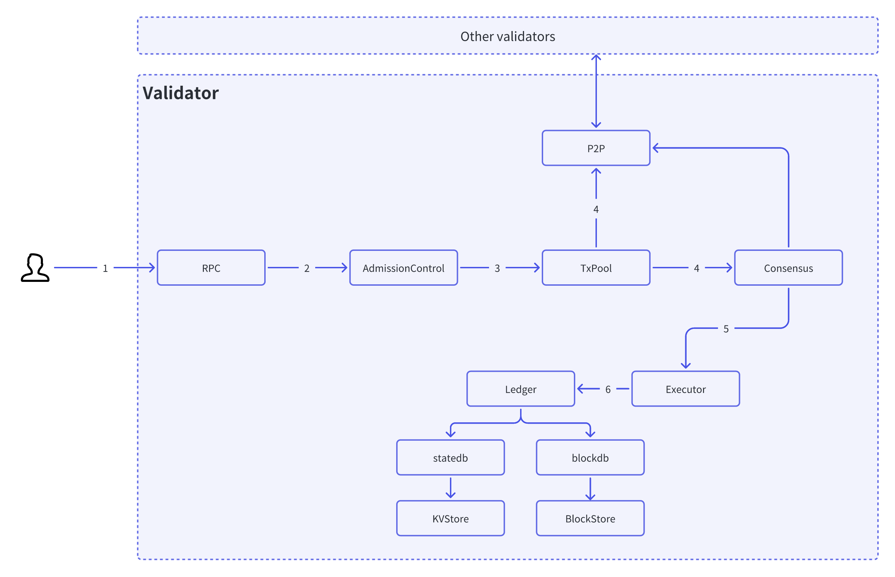

In the previous chapters, we provided an overview of the network topology, internal structure of the Validator, 
and relationships between components in the AxiomLedger. 

To further our understanding of the entire lifecycle of transactions in AxiomLedger, this chapter will track 
in detail the flow of a transaction through various components within a validator node, analyzing the
 transaction processing logic at each component. The diagram below illustrates the workflow of a transaction 
 entering an AxiomLedger Validator:

By examining the transaction workflow across node components, we can clearly see the end-to-end process 
from the transaction entering the node to being packaged into a block, including validation, ordering, 
consensus, and other processing phases. This helps readers thoroughly understand the underlying mechanisms
 and principles of AxiomLedger transactions, as well as the role each component plays in transaction 
 processing. The logic implemented at each component will be discussed in the following sections.

## Submitting Transaction

As an end user, you can directly construct raw transactions on the blockchain using a wallet (e.g. MetaMask) 
or DApp, then sign them with your private key (typically also done through the wallet) before sending them 
to a blockchain node. 

A valid transaction submitted to the blockchain must include at least:

* The raw transaction body (TODO: add reference)
* The user's public key 
* The user's signature for the transaction

## Receiving Transaction

The RPC interface module of AxiomLedger is responsible for receiving transaction requests submitted by
 end users. To be compatible with the Ethereum ecosystem, AxiomLedger implements most Ethereum RPC interface 
 specifications and also provides additional customized governance service interfaces.

To prevent DoS attacks, the RPC interface module has flow control capabilities. When transaction requests 
exceed the system processing limit, the request will be rejected directly. For transactions within the 
processing capacity scope, they will be forwarded to the internal admission control service for subsequent processing.

## Validating Transaction

The admission control component will validate the security of submitted transactions, which mainly includes:

- `Transaction format validity check`: Verify if the transaction parameters conform to specifications.
- `Signature validity check`: Validate if the user's signature is valid.
- `Balance check`: Check if the user has sufficient balance to pay for Gas fees. 
- `Sequence number check`: Verify if the transaction sequence number is in ascending order.

Invalid transactions that fail validation are discarded directly, while valid transactions are cached in the transaction pool.

## Consensusing on Transaction

For transactions entering the transaction pool, AxiomLedger will perform two operations:

1. Broadcast the transaction to neighboring nodes on the blockchain network via P2P services. 

2. If the validator node is the primary node of the consensus group, it will periodically retrieve batches of transactions from the pool and initiate a consensus proposal. 
The consensus algorithm will then execute multiple rounds of consensus steps to have most validator nodes on the network agree on the order of the batched transactions.

This allows quick propagation of transactions across the network, while the consensus algorithm ensures 
all nodes reach consensus on the transaction ordering. This guarantees consistency of transaction sequences 
and security of blockchain data.

## Executing Transactions

Batched transactions (blocks) confirmed by the consensus algorithm are input into the executor for execution. 
The AxiomLedger executor calls different executors to process transactions based on transaction type. System 
transactions are processed by calling system contracts, while regular transactions are processed by the ethereum
virtual machine. 

After transaction execution is complete, the world state is changed. The executor sends the world state changes 
along with the block over to the ledger module.

## Persisting State

The ledger module calls different underlying storage engines to persist data based on the data type being changed.
World state changes are persisted in the underlying KV database, while block data is stored in the underlying 
sequential database. This separation of storage by data type allows for optimized data access patterns, with the 
KV store better suited for random reads/writes of world state, and the sequential store for ordered appending 
of new blocks. The ledger module abstracts persistence operations behind standard interfaces, enabling 
interchangeability of storage engines as improvements emerge. By leveraging mature and efficient database 
technologies, AxiomLedger achieves scalable and reliable persistence of the blockchain state.