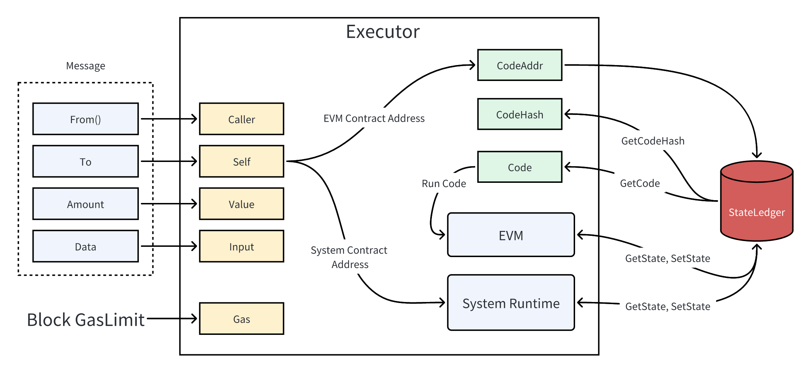
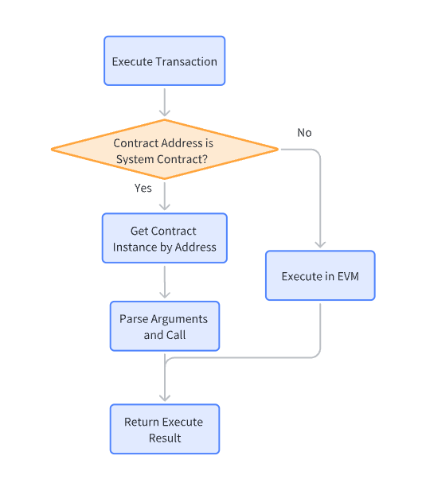

## Virtual Machine

In addition to recording activities related to AXM, Axiom also offers more powerful functionalities: smart contracts and system contracts. For these two functionalities, Axiom has built a distributed state machine similar to Ethereum. Axiom's state is a large data structure that not only stores all accounts and balances but also maintains a machine state. This state can be altered between different blocks according to a predefined set of rules and can execute arbitrary machine code. The state stored on the Axiom ledger can be accessed and modified through smart contracts and system contracts.

## Smart Contract

A smart contract is essentially a program that runs on the Axiom blockchain. It consists of a series of code (functions) and data (state) located at a specific address on the Axiom blockchain.

Smart contracts are also Axiom accounts, known as contract accounts. This means they have balances and can be the recipients of transactions. However, they cannot be controlled by individuals; they are deployed on the network to run as programs. Individual users can interact with smart contracts by submitting transactions that execute specific functions within the smart contract. Smart contracts can define rules and automatically enforce them through code, similar to traditional contracts. By default, smart contracts cannot be deleted, and interactions with them are irreversible.

In Axiom, the execution of smart contracts is performed through the EVM (Ethereum Virtual Machine).

## From Tx to Executor

When a transaction is sent to the blockchain and enters the execution module, the various fields of the transaction are parsed. The executor can determine whether the transaction is a smart contract or a system contract based on the transaction's destination field.

When the executor identifies that the transaction's destination address is a smart contract, it reads the corresponding smart contract's execution code from the blockchain ledger and loads it into the EVM (Ethereum Virtual Machine) for execution.

When the executor identifies that the transaction's destination address is a system contract, it directly processes the transaction within the system contract for execution.

Both smart contracts and system contracts can access the state of the ledger through specific interfaces provided by the ledger.

## System Contract

The system contract execution process is shown in the figure below, and the main steps are as follows:

1. The transaction enters the executor and executes the transaction;

2. Determine whether the To address of the transaction is the system contract address, if so, execute the next step, otherwise execute the transaction in the EVM and return the execution result;

3. Read the object instance corresponding to the system contract address;

4. Parse the execution parameters and call the execution function of the object instance;

5. Return the execution result.

