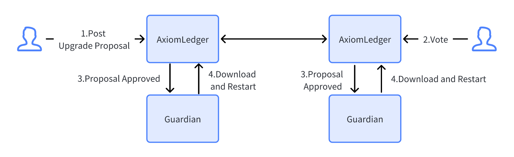

During the operation of the blockchain, it is inevitable that it will need to be upgraded for various reasons, such as bug fixes, function updates, parameter adjustments, and so on.

In order to avoid forks in the chain during the upgrade process and ensure the consistency of different node versions, an upgrade proposal is first initiated through governance, and the governance committee votes. After the vote meets the conditions (currently more than half of the votes passed), then If the upgrade proposal is accepted, the version will be upgraded after the specified block height to ensure the version consistency of the blockchain nodes.

## Upgrade Process

The chain upgrade process is shown in the figure below, and the main steps are as follows:

1. Members of the Governance Committee submit an upgrade proposal, which includes proposal type, proposal name, proposal description, block height for the proposal to take effect, download address of the upgrade chain node, and verification hash;

2. Other members of the Governance Committee vote on the upgrade proposal, which can only be passed or rejected;

3. When the number of votes passed by the upgrade proposal meets certain conditions (currently more than half of the passed votes), the upgrade proposal is passed;

4. The guardian service triggers the upgrade process after listening to the event that the upgrade proposal is passed, downloads the new version of the node package, and upgrades the node after the new block height reaches the effective block height, shuts down the old version node and starts the new version node.

