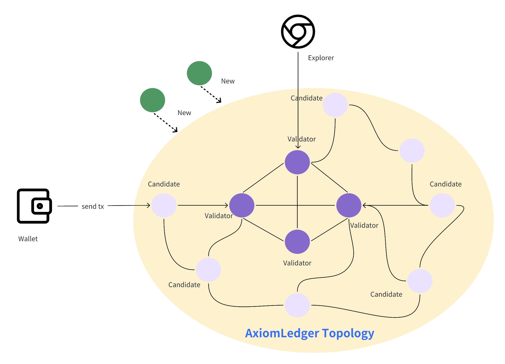
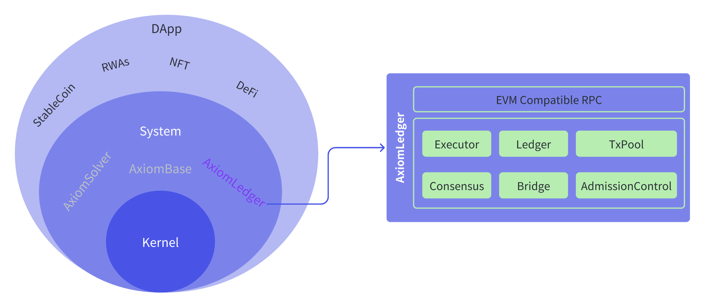

## Introduction

To enable readers to fully understand the AxiomLedger architecture, this chapter will introduce it in detail from a macro t
o micro perspective.

Firstly, from a network topology perspective, AxiomLedger consists of multiple validator nodes connected via P2P. 
These validator nodes form the infrastructure of AxiomLedger.

Secondly, we will look inside the structure of each validator node. Every validator node contains various core components 
that collectively implement functions like transaction processing and consensus. 

Finally, we will analyze each core component in detail, including its responsibilities, interaction interfaces, etc. 
This will present a comprehensive system architecture spanning from the overall network, individual nodes to the 
component level.

## Network topology

The AxiomLedger network consists of the following main components (as shown in the figure below):

- `Blockchain nodes`: Connected via P2P networks, using consensus algorithms to maintain a common ledger. 
Node roles are divided into new nodes, candidate nodes and validation nodes(including special block proposer node), according to their degree of 
participation in consensus. Node roles can be converted to each other, please refer to (TODO: Consensus XX section) 
for details.
- `Wallet services`: The bridge for users/DApps to interact with the blockchain, responsible for constructing and 
forwarding transactions.
- `Blockchain browsers`: Connect to blockchain nodes, store and parse on-chain data, and provide visual access t
o blockchain data for users. 

Specifically, new nodes are nodes that have not yet obtained network access permission through governance voting, 
candidate nodes are currently not participating in consensus block production, validation nodes are elected to participate in block production, and block proposer nodes are validator node that proposer blocks.

## Node Architecture

In order to facilitate the reuse of decentralized node core services, the Axiomesh ecosystem adopts 
a "kernel + system + application" modular design pattern. The kernel layer is responsible for the 
underlying functions of generic decentralized systems (such as P2P, storage, monitoring, configuration, etc.); 
The system layer can use kernel layer services to build decentralized system services, such as blockchain 
services, Layer 2 (execution layer) services, cross-chain bridge services, and decentralized 
storage (data availability) services, etc. Finally, at the application layer, the API services provided by 
the system layer can be used to build decentralized applications (such as stablecoins, RWAs, NFTs, DeFi, etc.).

This chapter will focus on introducing the component architecture of the blockchain system 
layer `AxiomLedger` validation node, including the EVM compatible RPC service, transaction executor, 
blockchain ledger service, transaction memory pool, consensus algorithm, cross-chain bridge, and 
access control logic.

## Core components

AxiomLedger nodes are responsible for core business operations of the blockchain network such as 
ledger data storage, transaction execution, state services, etc. Each blockchain node consists of 
multiple related logical components:

### RPC

In order to be compatible with EVM ecosystem tools, AxiomLedger's interface services adopt `Ethereum-compatible 
JSON RPC` services. The core interfaces for accessing EVM are implemented to be compatible, including contract deployment, 
invocation, basic chain information query, etc. In addition, the Axiomesh blockchain extends interfaces related to interacting 
with native governance services on the blockchain, including proposal management, governance member management, 
node upgrades, etc.

### TxPool

The transaction pool component is mainly used to cache and manage transactions submitted to blockchain nodes that have 
not yet been packaged and executed. The data in the transaction pool is only fully synchronized between validator nodes. 
Transactions in the transaction pool come from two sources, one is transactions submitted by applications received directly 
through the RPC service of the node itself, and the other is transactions forwarded from other validator/candidate nodes through the network 
service. When the current node is the block producer node in the consensus algorithm, the consensus algorithm will pull a certain 
number of transactions from the transaction pool to form a block, and broadcast this block to other validator nodes in the
 network. After this block is consented by the consensus network, each validator node executes the transactions in the block and 
 updates the ledger records.

### Executor

The executor component is the core component that executes transaction logic in blockchain nodes. The executor receives 
a list of transactions ordered by consensus, executes specific transactions by invoking the underlying contract execution 
engine, and generates temporary ledger changes. After the execution results are consented, the changed data is written 
to persistent ledger state database through the ledger. The executor invokes different contract execution engines depending
 on the transaction type. AxiomLedger contains built-in contract execution engines and equivalent EVM contract 
 execution engines:

* `Built-in contract execution engine`: Used to execute built-in system contracts, including governance contracts, upgrade contracts, economic management contracts, epoch management contracts and other blockchain system management contracts.
* `EVM equivalent execution engine`: Used to execute contracts submitted by external users, including various DApp business logic contracts such as ERC20, ERC721, DEX.

### Consensus

The consensus component is responsible for determining the order of blockchain transactions and verifying the consistency of 
the blockchain ledger state. AxiomLedger adopts the `dBFT` (delegated Byzantine Fault Tolerance) consensus algorithm, balancing
 node scalability and fast finality. `dBFT` introduces the concept of epoch on the basis of traditional BFT algorithms. 
 At the beginning of each epoch, the `dBFT` algorithm uses a randomly verifiable function to elect a fixed number of new validator node sets 
 from the node set consisting of validator nodes and candidate nodes. These new validator nodes will continue to work until the beginning of the next epoch.

### Ledger

The ledger component provides the ability to manage blockchain world state data and block data. The state data includes account related information such as 
balance, permissions, nonce value, etc. For special accounts such as contract accounts, it also contains the contract bytecode and all related changed states 
involved in the contract. In addition, the ledger also provides the ability to manage block data. Block data includes blocks, transactions, transaction receipts 
and other persistent non-mutable data, mainly providing storage and query services for such data. In addition, the ledger module can also rely on the Merkle tree to provide the ability of Merkle proof of critical data within the ledger.

The ledger component is responsible for managing the world state and block data of the blockchain:

1. `State data`: Includes account information such as balance, permissions, nonce, etc. For smart contract accounts, it also contains contract bytecode and 
related state changes.
2. `Block data`: Includes blocks, transactions, transaction receipts and other persistent non-state change data, providing storage and query services. 
3. `Merkle proof`: Merkle proofs of critical data in the ledger can be generated through the Merkle tree.

The ledger component targets state and block data, using data structures suitable for their access patterns respectively, which can efficiently manage
 core blockchain data. At the same time, it supports generating Merkle proofs, which is helpful for data verifiability. This design enables the ledger 
 component to meet the blockchain's demands for state changes, historical records, data proofs and more.

### Bridge

The cross-chain bridge component is responsible for managing AxiomLedger's cross-chain related services, including ingress and egress channels 
for cross-chain transactions, relay routing for cross-chain transactions, and oracles for cross-chain services.

### Admission Control

The admission control component provides the capability of secure validation for transactions. This component provides basic transaction validity 
check services, including transaction format, signature information, Gas fees, etc.